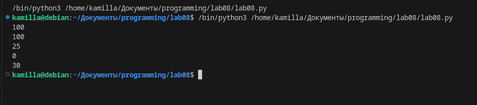
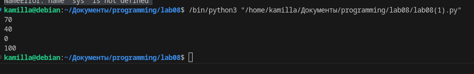

# Лабораторгная работа №11
## Задания: 
### Замыкание для отслеживания количества HP героя - HP не может подниматься больше 100 и опускаться ниже 0, герой может лечиться или получать урон.
    Решите обе задачи своего варианта.
    Примените декоратор к замыканию.
### 2. Оформите README.md. Он должен содержать:
    Название вашего приложения
    Описание
    Инструкции по запуску
    Краткую справку
# Выполнение заданий:
# Задача 1

```
def create_hero():
    hp = 100

    def get_hp():
        return hp

    def change_hp(delta):
        nonlocal hp
        new_hp = hp + delta
        if new_hp > 100:
            hp = 100
        elif new_hp < 0:
            hp = 0
        else:
            hp = new_hp

    def heal(amount):
        nonlocal hp
        change_hp(amount)

    def take_damage(amount):
        nonlocal hp
        change_hp(-amount)

    return get_hp, heal, take_damage

# Создаем экземпляр героя
hero_hp, hero_heal, hero_damage = create_hero()

# Пример использования
print(hero_hp())  # Выведет 100

hero_heal(50)  # Герой лечится на 50 HP
print(hero_hp())  # Выведет 100

hero_damage(75)  # Герой получает урон на 75 HP
print(hero_hp())  # Выведет 25

hero_damage(50)  # Герой получает урон на 50 HP
print(hero_hp())  # Выведет 0

hero_heal(30)  # Попытка вылечить героя на 30 HP, но его значение уже достигло минимума 0
print(hero_hp())  # Выведет 0
```

## Eсли у вас Visual Studio Code, то просто нажмите на данную клавишу:


## И нам в терминоле выходит результат


 
```
def limit_hp(min_hp, max_hp):
    def decorator(func):
        def wrapper(*args, **kwargs):
            # Получаем текущее количество HP героя
            hp = func(*args, **kwargs)

            # Проверяем, чтобы HP не превышало максимальное значение
            if hp > max_hp:
                hp = max_hp

            # Проверяем, чтобы HP не было меньше минимального значения
            if hp < min_hp:
                hp = min_hp

            # Возвращаем скорректированное количество HP
            return hp
        return wrapper
    return decorator

def suppress_output(func):
    def wrapper(*args, **kwargs):
        # Сохраняем текущее значение sys.stdout
        original_stdout = sys.stdout

        # Переопределяем sys.stdout для подавления вывода на консоль
        sys.stdout = open(os.devnull, 'w')

        # Вызываем функцию, но ее вывод не будет виден на консоли
        result = func(*args, **kwargs)

        # Восстанавливаем оригинальное значение sys.stdout
        sys.stdout = original_stdout

        # Возвращаем результат выполнения функции
        return result
    return wrapper

# Пример использования замыкания для отслеживания HP героя
@limit_hp(0, 100)
def hero_hp(hp_change):
    # Увеличиваем или уменьшаем количество HP героя на заданную величину
    global hero_hp_value
    hero_hp_value += hp_change
    return hero_hp_value

# Пример использования декоратора для подавления вывода функции на консоль
@suppress_output
def example_function():
    print("This text will not be shown on the console.")

# Пример вызова функции с использованием замыкания
hero_hp_value = 50
print(hero_hp(20))  # Выведет: 70
print(hero_hp(-30))  # Выведет: 40
print(hero_hp(-100))  # Выведет: 0
print(hero_hp(200))  # Выведет: 100

# Пример вызова функции с использованием декоратора
example_function()  # На консоли ничего не будет выведено

```

## Eсли у вас Visual Studio Code, то просто нажмите на данную клавишу:


## И нам в терминоле выходит результат


 

