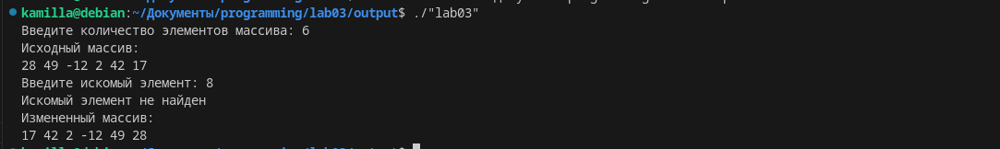

# Лабораторная работа №3
## Задания для самостоятельного выполнения
    Напишите программу по своему варианту.
    Оформите отчёт в README.md. Отчёт должен содержать:
        Задание
        Описание проделанной работы
        Скриншоты результатов
        Ссылки на используемые материалы
##  Вариант 7: 
Найти в массиве первое вхождение искомого элемента, а все элементы в частях массива до и после него “перевернуть”, то есть поменять порядок их следования на обратный. Если такого элемента нет, “перевернуть” весь массив.
# Выполение работы:
## Написать код:


```
#include <stdio.h>
#include <stdlib.h>
#include <time.h>

void reverseArray(int arr[], int start, int end) {
    while (start < end) {
        int temp = arr[start];
        arr[start] = arr[end];
        arr[end] = temp;
        start++;
        end--;
    }
}

int findAndReverse(int arr[], int size, int searchElement) {
    int i;
    for (i = 0; i < size; i++) {
        if (arr[i] == searchElement) {
            reverseArray(arr, 0, i - 1);
            reverseArray(arr, i + 1, size - 1);
            return i;
        }
    }
    reverseArray(arr, 0, size - 1);
    return -1;
}

int main() {
    int size, searchElement;
    printf("Введите количество элементов массива: ");
    scanf("%d", &size);

    int arr[size];
    srand(time(0)); // Инициализация генератора случайных чисел

    printf("Исходный массив:\n");
    for (int i = 0; i < size; i++) {
        arr[i] = rand() % 101 - 50; // Генерация случайного числа в диапазоне [-50, 50]
        printf("%d ", arr[i]);
    }
    printf("\n");

    printf("Введите искомый элемент: ");
    scanf("%d", &searchElement);

    int index = findAndReverse(arr, size, searchElement);

    if (index != -1) {
        printf("Первое вхождение искомого элемента: %d\n", index);
    } else {
        printf("Искомый элемент не найден\n");
    }

    printf("Измененный массив:\n");
    for (int i = 0; i < size; i++) {
        printf("%d ", arr[i]);
    }
    printf("\n");

    return 0;
}
```
## Результат работы в терминале:

