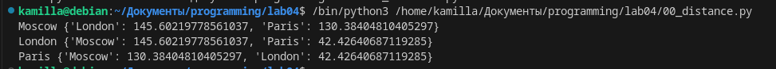
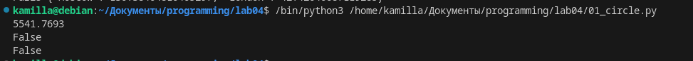
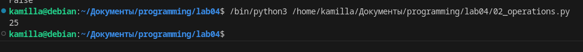
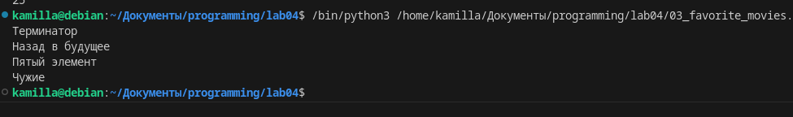
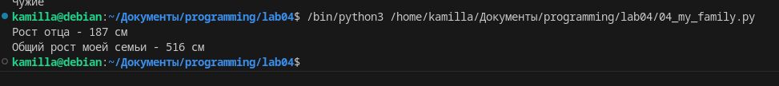
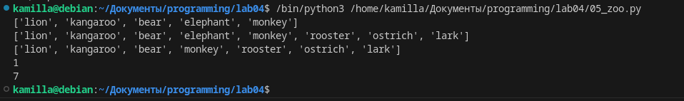
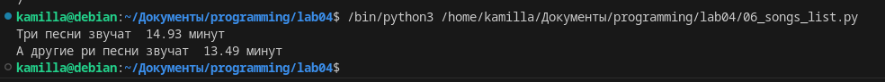
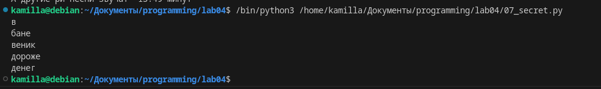
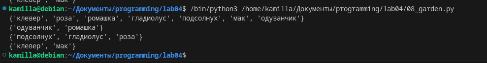
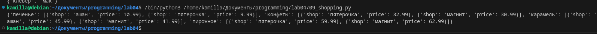

# Лабораторгная работа №4
## Задания:
1. Скачайте архив и распакуйте его в свой репозиторий. В нём 11 заданий, которые вам нужно выполнить.
2. Оформите отчёт в `README.md`. По каждому из заданий - описание задачи, скриншот работы программы.
# 2. Оформите отчёт в README.md. По каждому из заданий - описание задачи, скриншот работы программы.
# 00_distance.py

# 01_circle.py

# 02_operations.py

# 03_favorite_movies.py

# 04_my_family.py

# 05_zoo.py

# 06_song_list.py

# 07_secret.py

# 08_garden.py

# 09_shopping.py

# 10_store.py

