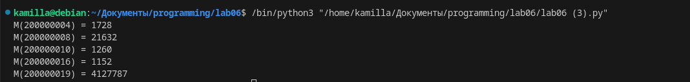

# Лабораторная работа №6
## Задания: 
    Напишите программу для решения задач своего варианта.
    Оформите отчёт в README.md. Отчёт должен содержать:
        Условия задач
        Описание проделанной работы
        Скриншоты результатов
        Ссылки на используемые материалы
 Решения задач оформить в виде функций, возвращающих ответы. Для решения первой задачи использовать itertools.
# Вариант 7:
    Иван составляет таблицу кодовых слов для передачи сообщений, каждому сообщению соответствует своё кодовое слово. В качестве кодовых слов Иван использует все пятибуквенные слова в алфавите {A, B, C, D, E}, удовлетворяющие такому условию: кодовое слово не может начинаться с буквы E и заканчиваться буквой A. Сколько различных кодовых слов может использовать Иван?

    Сколько единиц содержится в двоичной записи значения выражения: 4511+2511−5114511+2511−511?

    Пусть M(N)M(N)  — произведение 5 наименьших различных натуральных делителей натурального числа NN, не считая единицы. Если у числа NN меньше 5 таких делителей, то M(N)M(N) считается равным нулю.

    Найдите 5 наименьших натуральных чисел, превышающих 200 000 000, для которых 0 < M(N) < N0 < M(N) < N. В ответе запишите найденные значения M(N)M(N) в порядке возрастания соответствующих им чисел NN.
## Написала код для каждого задания


```
import itertools

def count_code_words():
    alphabet = ['A', 'B', 'C', 'D', 'E']
    code_words = list(itertools.product(alphabet, repeat=5))
    filtered_code_words = [word for word in code_words if word[0] != 'E' and word[4] != 'A']
    return len(filtered_code_words)

print(count_code_words())
```
## Вывод в треминале: 


```
import itertools
def count_ones():
    expression = 4**511 + 2**511 - 511
    binary = bin(expression)[2:]  # преобразование в двоичную запись
    count = binary.count('1')  # подсчет количества единиц
    return count

print(count_ones())
```
## Вывод в треминале: 


```
from itertools import count, islice
from math import prod

def M(N):
    divisors = []
    for i in range(2, N // 2 + 1):
        if N % i == 0:
            divisors.append(i)
            if len(divisors) == 5:
                break
    if len(divisors) < 5:
        return 0
    else:
        return prod(divisors)

def find_numbers():
    numbers = []
    for n in islice(count(200000001), None):
        m = M(n)
        if 0 < m and m < n:
            numbers.append((n, m))
            if len(numbers) == 5:
                break
    return sorted(numbers, key=lambda x: x[0])

result = find_numbers()
for n, m in result:
    print(f"M({n}) = {m}")
```


