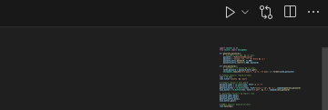
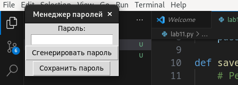

# Лабораторгная работа №11
## Задания: 
### 1.Реализуйте приложение с GUI (приложения-игры допускается делать с использованием TUI-пакетов) по своему варианту. Можно изменить задание на собственную тему, согласовав с преподавателем. Список GUI фреймворков:

    appJar
    Tkinter
    Flet
    wxPython
    PySimpleGUI
    Pyforms
    Toga
    PyGObject
    guizero
    guietta
    PySide6
    Dear PyGui
    PyGame

### 2. Оформите README.md. Он должен содержать:

    Название вашего приложения
    Описание
    Инструкции по запуску
    Краткую справку
# Выполнение заданий:
# Менеджер паролей
## Мой простой менеджер паролей с использованием Tkinter. Его функции:
### Генерация паролей 
### Сохранение ваших паролей.
## Сама программа:

```
import tkinter as tk
from tkinter import messagebox

def generate_password():
    # Реализуйте генерацию пароля здесь
    password = "MyGeneratedPassword"
    password = "Сделаем вид, что тут умный пароль"
    password_entry.delete(0, tk.END)
    password_entry.insert(tk.END, password)

def save_password():
    # Реализуйте сохранение пароля здесь
    saved_password = password_entry.get()
    messagebox.showinfo("Сохранено", "Пароль сохранен: {}".format(saved_password))

# Создание главного окна приложения
root = tk.Tk()
root.title("Менеджер паролей")

# Создание элементов интерфейса
password_label = tk.Label(root, text="Пароль:")
password_entry = tk.Entry(root)
generate_button = tk.Button(root, text="Сгенерировать пароль", command=generate_password)
save_button = tk.Button(root, text="Сохранить пароль", command=save_password)

# Размещение элементов на главном окне
password_label.pack()
password_entry.pack()
generate_button.pack()
save_button.pack()

# Запуск главного цикла приложения
root.mainloop()
```
## Для того, чтобы программа запустилась вводим в терминал, смотря какие у вас папки: 
 
```
/bin/python3 /home/kamilla/Документы/programming/lab11/lab11.py
```
## Но если у вас Visual Studio Code, то просто нажмите на данную клавишу:


## Теперь вам всплыло окно, которое может вам сгенерировать пароль или сохранить вами придуманный пароль




